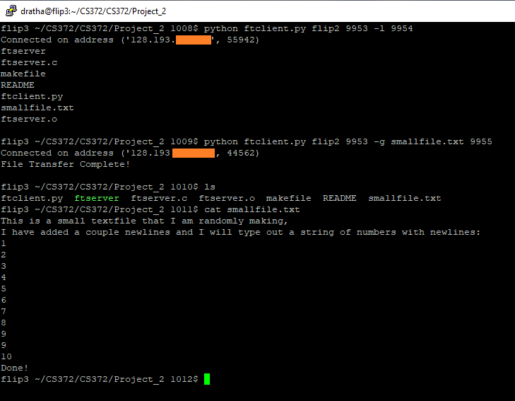

# File Transfer
## Description:
    Design and implement a simple file transfer system, i.e., create 
    a file transfer server and a file transfer client. Write the 
    ftserver and the ftclient programs. The final version of your
    programs must accomplish the following tasks:
    1. ftserver starts on Host A, and validates command-line parameters
        (<SERVER_PORT>).
    2. ftserver waits on <PORTNUM> for a client request.
    3. ftclient starts on Host B, and validates any pertinent 
        command-line parameters. (<SERVER_HOST>, <SERVER_PORT>, 
        <COMMAND>, <FILENAME>, <DATA_PORT>, etc…)
    4. ftserver and ftclient establish a TCP control connection 
        on <SERVER_PORT>. (For the remainder of this description, call
        this connection P)
    5. ftserver waits on connection P for ftclient to send a command.
    6. ftclient sends a command (-l (list) or -g <FILENAME> (get)) on 
        connection P.
    7. ftserver receives command on connection P.
        If ftclient sent an invalid command
            a) ftserver sends an error message to ftclient on connection
                P, and ftclient displays the message on-screen.
                otherwise
            a) ftserver initiates a TCP data connection with ftclient 
                on <DATA_PORT>. (Call this connection Q)
            b) If ftclient has sent the -l command, ftserver sends its
                directory to ftclient on connection Q, and ftclient 
                displays the directory on-screen.
            c) If ftclient has sent -g <FILENAME>, ftserver validates FILENAME, and
                either
                    i) sends the contents of FILENAME on connection Q. 
                        ftclient saves the file in the current default 
                        directory (handling "duplicate file name" error if
                        necessary), and displays a "transfer complete" 
                        message on-screen
                or
                    ii) sends an appropriate error message (“File not found”
                        , etc.) to ftclient on connection P, and ftclient 
                        displays the message on-screen.
            d) ftserver closes connection Q (don’t leave open sockets!).
    8. ftclient closes connection P (don’t leave open sockets!) and terminates.
    9. ftserver repeats from 2 (above) until terminated by a supervisor (SIGINT).

## Usage
Tested on Flip 2 and Flip 3.
To get the directory input:
  server: ./ftserver [port] (ex. ./ftserver 9953)
  client: python ftclient.py [server host] [server port] -l [data port] (ex. python ftclient.py flip3 9953 -l 9954)
  
To get the file_copy:
  server: ./ftserver [port] (ex. ./ftserver 9953)
  client: python ftclient.py [server host] [server port] -g [filename] [data port] (ex. python ftclient.py flip3 9953 -g smalltext.txt 9954)
  
server host will be the host of the server (ex. flip3)
server port and data port must be between 1024-65535

## Demonstration
Server

Client

